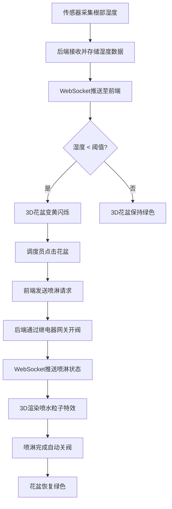
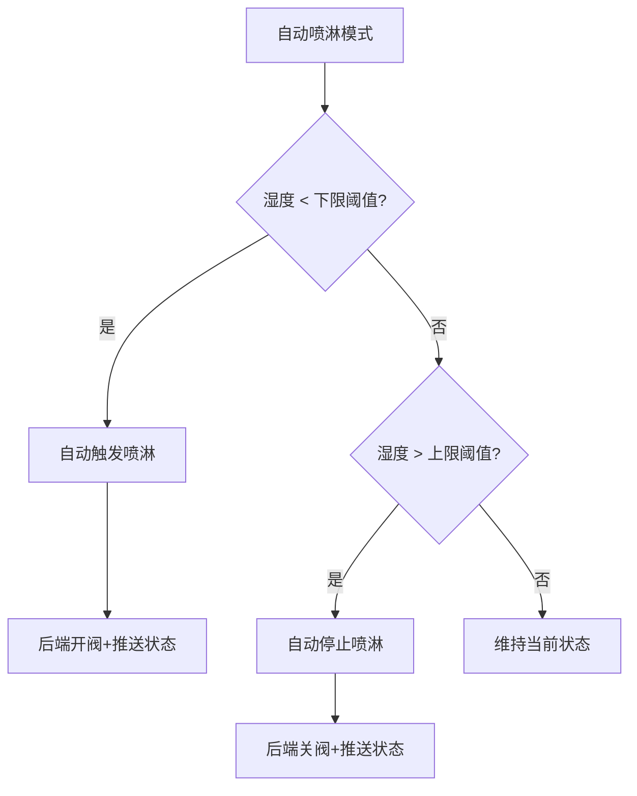

## 1. 产品概述

铁皮石斛挂壁栽培矩阵精细化微喷水控制系统——"挂壁矩阵数字孪生系统"，面向中药材基地温室大棚，对墙壁上成方阵排列的石斛花盆进行实时根部湿度监控与微量喷淋精准控制。

- 解决传统大棚灌溉粗放、石斛根部湿度过低导致药效下降的问题，实现每盆石斛独立湿度监测与秒级喷淋响应
- 目标用户：中药材基地调度员、大棚运维人员；核心价值：降低石斛死亡率、提升药材品质、节水降耗

## 2. 核心功能

### 2.1 用户角色

| 角色 | 注册方式 | 核心权限 |
|------|----------|----------|
| 调度员 | 管理员分配账号 | 查看湿度数据、手动/自动触发喷淋、查看历史曲线 |
| 管理员 | 系统初始化 | 调度员全部权限 + 阈值配置 + 设备管理 |

### 2.2 功能模块

1. **数字孪生大屏页**：3D挂壁花盆矩阵可视化、实时湿度状态映射、喷淋粒子特效、点击交互控制
2. **数据监控面板页**：湿度趋势曲线、报警记录列表、喷淋操作日志、阈值配置

### 2.3 页面详情

| 页面名称 | 模块名称 | 功能描述 |
|----------|----------|----------|
| 数字孪生大屏 | 3D挂壁矩阵场景 | 渲染整面墙的花盆方阵（6列×8行=48盆），每盆独立颜色映射湿度状态 |
| 数字孪生大屏 | 湿度状态映射 | 湿度正常→绿色花盆，低于阈值→黄色花盆并闪烁告警 |
| 数字孪生大屏 | 点击喷淋交互 | 点击黄色花盆→向后方发送喷淋指令→3D播放水粒子喷洒特效 |
| 数字孪生大屏 | 喷淋状态反馈 | 喷淋进行中→蓝色粒子特效+花盆发蓝光，喷淋结束→恢复绿色 |
| 数字孪生大屏 | 矩阵信息面板 | 右侧悬浮面板显示选中花盆ID、当前湿度、阈值、历史曲线缩略图 |
| 数字孪生大屏 | 全局统计栏 | 顶部显示：总盆数、正常数、告警数、喷淋中数 |
| 数据监控面板 | 湿度趋势图 | 选中花盆的历史湿度时序曲线（TimescaleDB数据） |
| 数据监控面板 | 报警记录 | 湿度低于阈值的历史报警记录，按时间倒序 |
| 数据监控面板 | 操作日志 | 所有手动/自动喷淋操作记录 |
| 数据监控面板 | 阈值配置 | 设置石斛生长湿度阈值上下限（默认下限40%、上限70%） |

## 3. 核心流程

**调度员监控与喷淋流程**：系统通过传感器实时采集每盆石斛的根部湿度数据，通过WebSocket推送至前端3D大屏；当某盆湿度低于生长阈值时，3D模型自动变黄闪烁；调度员点击告警花盆，系统通过继电器网关秒级打开对应微量喷淋阀，3D界面同步渲染喷水粒子特效；喷淋完成后阀门自动关闭，花盆恢复绿色。

## 4. 用户界面设计

### 4.1 设计风格

- **主题风格**：工业自然融合——深色工业底色 + 植物绿点缀，营造智能温室控制室氛围
- **主色调**：深墨绿（#0A1F1A）作为背景，翠绿（#00C853）作为健康/正常状态色，琥珀黄（#FFB300）作为告警色，深蓝（#1565C0）作为喷淋状态色
- **辅助色**：浅灰（#E0E0E0）文字，暗灰（#37474F）面板背景
- **按钮风格**：圆角微凸按钮，hover时发光边框，告警按钮使用脉冲动画
- **字体**：标题使用 "Orbitron" 科技感字体，正文使用 "Noto Sans SC" 中文字体
- **布局**：左侧主3D场景（占70%），右侧信息面板（占30%），顶部全局统计栏
- **图标风格**：线条图标（Lucide系列），搭配状态色圆点

### 4.2 页面设计概览

| 页面名称 | 模块名称 | UI元素 |
|----------|----------|--------|
| 数字孪生大屏 | 3D挂壁矩阵 | 深色背景，花盆模型绿/黄/蓝三态，墙壁纹理，环境光+点光源，轨道控制器旋转/缩放 |
| 数字孪生大屏 | 信息面板 | 半透明暗色卡片，显示花盆ID、湿度值、阈值，ECharts缩略曲线 |
| 数字孪生大屏 | 统计栏 | 顶部横条，4个统计数字带图标，数字实时更新带计数动画 |
| 数字孪生大屏 | 喷淋粒子 | 蓝色水滴粒子从花盆顶部喷射下落，粒子数量可配置 |
| 数据监控面板 | 趋势图 | 深色背景折线图，绿色正常区+黄色告警区底色带 |
| 数据监控面板 | 日志表格 | 暗色表头，交替行色，告警行黄色高亮 |

### 4.3 响应式设计

- 桌面优先设计，针对1920×1080大屏优化
- 支持缩放至1366×768笔记本屏幕，3D场景自适应
- 信息面板在小屏下可折叠为抽屉

### 4.4 3D场景指引

- **环境/HDRI**：深色温室夜景氛围，微弱顶部环境光模拟温室灯光
- **光照**：环境光（AmbientLight, 暖白色低强度）+ 每盆上方PointLight（颜色随状态变化：绿/黄/蓝）
- **相机**：PerspectiveCamera，初始位置正对墙壁，FOV 45°，OrbitControls支持旋转/缩放/平移
- **构图**：6×8花盆矩阵居中，墙壁平面为背景，左右留出信息面板空间
- **交互**：Raycaster点击拾取花盆，hover高亮边框，点击触发喷淋+粒子特效
- **动画**：花盆状态变化平滑过渡，告警花盆脉冲发光，喷淋粒子持续喷射3秒
- **后处理**：Bloom效果用于告警发光，可选FXAA抗锯齿
- **性能预算**：48个花盆模型 + 粒子系统，目标60FPS
