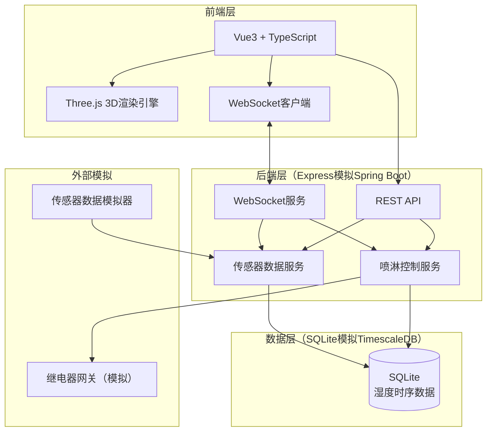
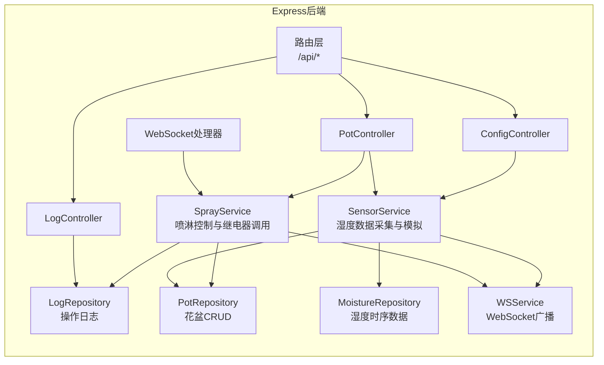
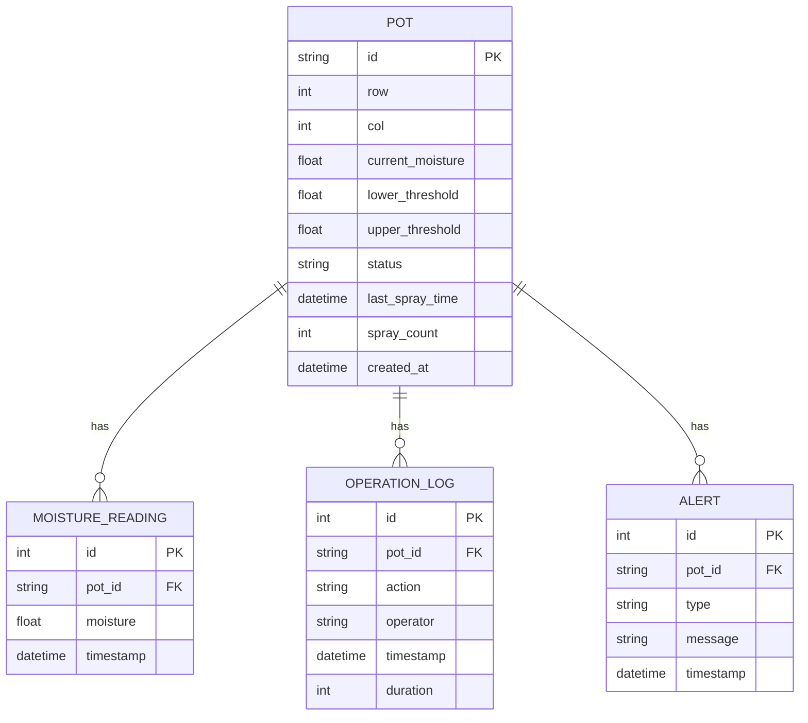

## 1. 架构设计



> **说明**：生产环境中后端使用 Spring Boot + TimescaleDB，本项目使用 Express + SQLite 进行原型开发，API接口与数据模型保持一致，便于后续迁移。

## 2. 技术说明

- **前端**：Vue3@3 + TypeScript + Three.js + Vite + TailwindCSS
- **初始化工具**：vite-init（vue-express-ts模板）
- **后端**：Express@4 + TypeScript（模拟Spring Boot接口）
- **数据库**：SQLite（模拟TimescaleDB时序存储，保留时序表结构设计）
- **3D渲染**：Three.js + OrbitControls + Raycaster + 粒子系统
- **实时通信**：ws（WebSocket库）

## 3. 路由定义

| 路由 | 用途 |
|------|------|
| `/` | 数字孪生大屏主页，3D花盆矩阵可视化 |
| `/monitor` | 数据监控面板，历史曲线+日志+配置 |

## 4. API定义

### 4.1 湿度数据API

```typescript
interface MoistureReading {
  potId: string
  moisture: number
  timestamp: string
}

// GET /api/pots - 获取所有花盆当前状态
interface GetPotsResponse {
  pots: Array<{
    id: string
    row: number
    col: number
    currentMoisture: number
    threshold: number
    status: 'normal' | 'warning' | 'spraying'
    lastSprayTime: string | null
  }>
}

// GET /api/pots/:id/history - 获取单盆历史湿度
interface GetPotHistoryResponse {
  potId: string
  readings: MoistureReading[]
}

// GET /api/pots/:id - 获取单盆详情
interface GetPotDetailResponse {
  id: string
  row: number
  col: number
  currentMoisture: number
  threshold: number
  upperThreshold: number
  status: 'normal' | 'warning' | 'spraying'
  lastSprayTime: string | null
  sprayCount: number
}
```

### 4.2 喷淋控制API

```typescript
// POST /api/pots/:id/spray - 手动触发喷淋
interface SprayRequest {
  duration?: number
}

interface SprayResponse {
  potId: string
  success: boolean
  message: string
  estimatedEndTime: string
}

// POST /api/pots/:id/stop - 停止喷淋
interface StopSprayResponse {
  potId: string
  success: boolean
}
```

### 4.3 配置API

```typescript
// GET /api/config/thresholds - 获取阈值配置
interface ThresholdConfig {
  lowerBound: number
  upperBound: number
}

// PUT /api/config/thresholds - 更新阈值配置
interface UpdateThresholdRequest {
  lowerBound: number
  upperBound: number
}
```

### 4.4 报警与日志API

```typescript
// GET /api/alerts - 获取报警记录
interface AlertRecord {
  id: number
  potId: string
  type: 'low_moisture' | 'spray_triggered' | 'spray_completed'
  message: string
  timestamp: string
}

// GET /api/logs - 获取操作日志
interface OperationLog {
  id: number
  potId: string
  action: 'manual_spray' | 'auto_spray' | 'stop_spray'
  operator: string
  timestamp: string
  duration: number
}
```

### 4.5 WebSocket消息协议

```typescript
// 服务端 → 客户端
interface WSMessage {
  type: 'moisture_update' | 'spray_status' | 'alert'
  payload: MoistureUpdatePayload | SprayStatusPayload | AlertPayload
}

interface MoistureUpdatePayload {
  updates: Array<{
    potId: string
    moisture: number
    status: 'normal' | 'warning' | 'spraying'
  }>
  timestamp: string
}

interface SprayStatusPayload {
  potId: string
  action: 'start' | 'complete'
  timestamp: string
}

interface AlertPayload {
  potId: string
  alertType: string
  message: string
}

// 客户端 → 服务端
interface WSClientMessage {
  type: 'spray_request' | 'stop_spray' | 'subscribe'
  payload: {
    potId: string
    duration?: number
  }
}
```

## 5. 服务端架构图



## 6. 数据模型

### 6.1 数据模型定义



### 6.2 数据定义语言

```sql
CREATE TABLE pot (
  id TEXT PRIMARY KEY,
  row INTEGER NOT NULL,
  col INTEGER NOT NULL,
  current_moisture REAL NOT NULL DEFAULT 0,
  lower_threshold REAL NOT NULL DEFAULT 40.0,
  upper_threshold REAL NOT NULL DEFAULT 70.0,
  status TEXT NOT NULL DEFAULT 'normal',
  last_spray_time TEXT,
  spray_count INTEGER NOT NULL DEFAULT 0,
  created_at TEXT NOT NULL DEFAULT (datetime('now'))
);

CREATE TABLE moisture_reading (
  id INTEGER PRIMARY KEY AUTOINCREMENT,
  pot_id TEXT NOT NULL REFERENCES pot(id),
  moisture REAL NOT NULL,
  timestamp TEXT NOT NULL DEFAULT (datetime('now'))
);

CREATE INDEX idx_moisture_pot_time ON moisture_reading(pot_id, timestamp);

CREATE TABLE operation_log (
  id INTEGER PRIMARY KEY AUTOINCREMENT,
  pot_id TEXT NOT NULL REFERENCES pot(id),
  action TEXT NOT NULL,
  operator TEXT NOT NULL DEFAULT 'system',
  timestamp TEXT NOT NULL DEFAULT (datetime('now')),
  duration INTEGER NOT NULL DEFAULT 0
);

CREATE TABLE alert (
  id INTEGER PRIMARY KEY AUTOINCREMENT,
  pot_id TEXT NOT NULL REFERENCES pot(id),
  type TEXT NOT NULL,
  message TEXT NOT NULL,
  timestamp TEXT NOT NULL DEFAULT (datetime('now'))
);

-- 初始化48盆石斛（6列×8行）
-- 数据将在后端初始化时自动生成
```
